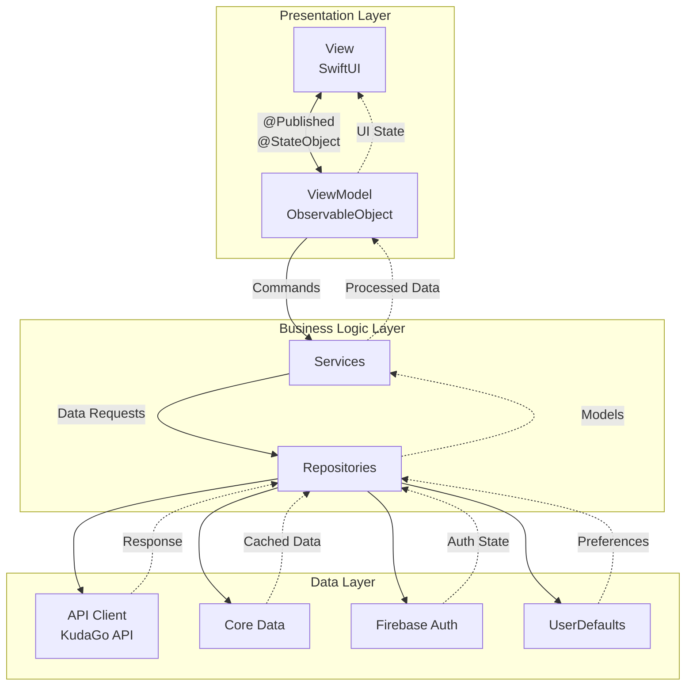
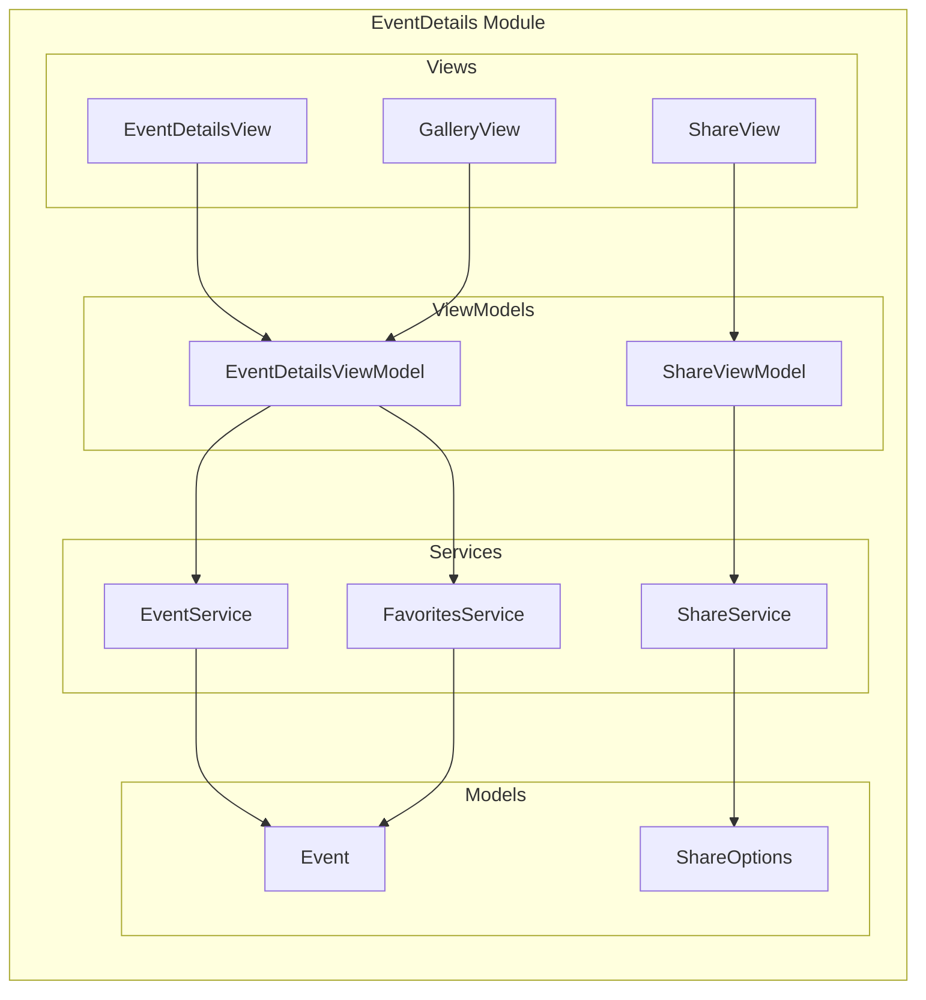

# EventHub - iOS Development Marathon Challenge

## 📋 Project Overview
EventHub is a comprehensive iOS application for discovering and managing local events, concerts, and exhibitions. The project follows a modular MVVM architecture with clear separation of concerns and feature-based organization.

## 🎯 Challenge Levels
### Base Level
#### Authentication Module
- [ ] Onboarding screens (first launch only)
- [ ] Sign In with email/password
- [ ] Google Sign-In integration
- [ ] "Remember Me" functionality
- [ ] Password reset flow
- [ ] Sign Up screen

#### Navigation Module
- [ ] Tab Bar with 5 tabs
- [ ] Active state visualization
- [ ] Map tab (placeholder)

#### Explore Module
- [ ] Location selection (city picker)
- [ ] Event categories from API
- [ ] "Upcoming Events" section
- [ ] "Nearby You" section
- [ ] Search functionality
- [ ] Filter button (UI only)
 
#### Events Module

 - [ ] List of next 7 days events
 - [ ] Upcoming/Past events toggle
 - [ ] Empty state handling
 - [ ] "Explore Events" navigation

#### Event Details Module

 - [ ] Full event information display
 - [ ] Add to favorites
 - [ ] Share functionality
 - [ ] Image gallery support

#### Profile Module

 - [ ] User information display
 - [ ] Edit profile capability
 - [ ] Sign out functionality
 
#### Favorites Module
 
- [ ] Favorites list management
- [ ] Remove from favorites
- [ ] Search within favorites
- [ ] Empty state

### Advanced Level  
#### Map Module

 - [ ] MapKit integration
 - [ ] Event pins with categories
 - [ ] Current location detection
 - [ ] Event preview on tap
 - [ ] Search on map

#### Notifications Module

- [ ] Local notifications setup
- [ ] 7/5/3/1 day reminders
- [ ] Notification management screen

#### Enhanced Explore Module

- [ ]  TODAY button (today's events)
- [ ]  FILMS section
- [ ]  LISTS with WebView

#### Filter Module

- [ ]  Category filtering
- [ ]  Date range selection
- [ ]  Location filtering
- [ ]  Price range slider

## Architecture Philosophy
Each feature is implemented as a self-contained module including:

- View Layer (SwiftUI views and components)
- ViewModel (Business logic and state management)
- Services (API integration, data persistence)
- Resources (Assets, localization, styles)
- Public API (Clear interfaces for module communication)

### MVVM Architecture
#### Architecture Overview

---
### Module Structure Example (Event Details)



## 🏗 Project Structure
```
EventHub/
├── App/
│   ├── EventHubApp.swift
│   ├── AppCoordinator.swift
│   └── Configuration/
├── Core/
│   ├── Network/
│   │   ├── APIClient.swift
│   │   └── Endpoints/
│   ├── Storage/
│   │   ├── CoreDataManager.swift
│   │   └── UserDefaultsManager.swift
│   └── Extensions/
├── Modules/
│   ├── Authentication/
│   │   ├── Views/
│   │   │   ├── OnboardingView.swift
│   │   │   ├── SignInView.swift
│   │   │   ├── SignUpView.swift
│   │   │   └── ResetPasswordView.swift
│   │   ├── ViewModels/
│   │   │   ├── AuthViewModel.swift
│   │   │   └── OnboardingViewModel.swift
│   │   ├── Services/
│   │   │   ├── AuthService.swift
│   │   │   └── FirebaseAuthManager.swift
│   │   └── Models/
│   │       └── User.swift
│   ├── Explore/
│   ├── Events/
│   ├── EventDetails/
│   ├── Profile/
│   ├── Favorites/
│   └── [Additional Modules]/
├── Shared/
│   ├── Components/
│   ├── Styles/
│   └── Resources/
└── SupportingFiles/
```

## 🛠 Technical Requirements
### Core Technologies
#### Data Management
- Core Data or Realm // Event storage and favorites
- UserDefaults // User preferences and settings

#### Networking & Images  
- URLSession // API communication
- Kingfisher // Efficient image loading and caching

#### Authentication
- Firebase Auth // User registration and login
- Google Sign-In // OAuth integration

### Minimum Deployment Target
* iOS 15.0+
* Swift 5.9+
* Xcode 15.0+

### Key Requirements:

* Onboarding shows only on first launch (UserDefaults flag)
* "Remember Me" persists authentication state
* Email validation and password strength checks
* Firebase Auth error handling
* Deep linking for password reset

## 📊 Data Management
### Local Storage
#### Core Data Entities
- EventEntity
- FavoriteEntity
- UserPreferencesEntity

#### UserDefaults Keys
- "hasCompletedOnboarding"
- "rememberMe"
- "selectedCity"
- 
### API Integration
* Base URL: https://kudago.com/public-api/v1.4/
* Key endpoints:
     + /locations/ - Cities list
     + /events/ - Events with filters
     + /event-categories/ - Event categories

## 🚀 Getting Started
### Setup Instructions
1. Clone repository
2. Add GoogleService-Info.plist
3. Configure API keys in Config.swift
4. Build and run

## Development Guidelines

- Create feature branches: feature/module-name
- One module = one pull request
- Include unit tests for ViewModels
- Document public APIs
- Follow Swift style guide

## 📚 Resources
### API Documentation
- [KudaGo API Docs](https://docs.kudago.com/api/)
- [Firebase Auth iOS](https://firebase.google.com/docs/auth/ios/start)
### Design Assets
* [Figma Design File](https://www.figma.com/design/P1E4JoRoXGBgk1Tyanamay/Challenge-%E2%84%963-%22Even-Hub%22?node-id=0-1&p=f&t=P4xKNrjLcmOXuz1h-0Challenge-№2-%22Best-Recipes%22?node-id=0-1&p=f&t=eySZ1N08umrkKJIJ-0 ) (password: Challenge3)
* App icons and assets included in project
### Recommended Libraries
#### Package.swift dependencies
.package(url: "https://github.com/onevcat/Kingfisher.git", from: "7.0.0"),
.package(url: "https://github.com/firebase/firebase-ios-sdk.git", from: "10.0.0"),